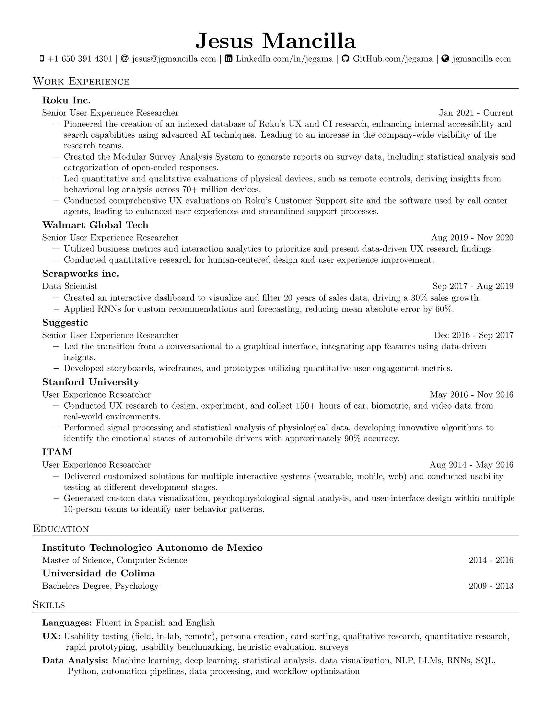

# Introduction

This repository contains the code for a set of tools that are deployed on a Google Cloud Run and are used on my website [jgmancilla.com](https://www.jgmancilla.com/). The tools are:

- My representative which is featured on the homepage of my website. I used RAG (Retrival Augmented Generation), indexing my resume and both of my portfolios ([research](https://www.jgmancilla.com/research-portfolio), and [machine learning](https://www.jgmancilla.com/ml-portfolio)).
- The [Customer Support Bot](https://www.jgmancilla.com/customer-support-bot-project) which also uses RAG to answer questions from the [Roku Support Site](https://support.roku.com/).

## Other projects

- **[Research Librarian](https://www.jgmancilla.com/research-librarian)**: The Research Librarian project was a groundbreaking initiative to develop an AI-powered index for UX and CI research. By leveraging advanced AI techniques similar to the [Calvinist Parrot](https://www.jgmancilla.com/calvinist-parrot) project, the aim was to enhance internal accessibility and search capabilities. This tool was envisioned as a dynamic solution to deepen users' understanding and interactions with the company's research data.
- **[Modular Survey Report Generator](https://www.jgmancilla.com/modular-survey-report-generator)**: I conceptualized, designed, and developed an upgraded version of our report generator that harnesses machine learning to analyze a wide array of surveys autonomously. The Modular Survey Analysis System I created has profoundly transformed the survey data analysis process, offering unprecedented flexibility, efficiency, and scalability.

# My publications

- [Baltodano, Sonia, Jesus Garcia-Mancilla, and Wendy Ju. "Eliciting Driver Stress Using Naturalistic Driving Scenarios on Real Roads." In Proceedings of the 10th International Conference on Automotive User Interfaces and Interactive Vehicular Applications, pp. 298-309. ACM, 2018.](https://dl.acm.org/authorize?N668220)
- [Currano, Rebecca, So Yeon Park, Lawrence Domingo, Jesus Garcia-Mancilla, Pedro C. Santana-Mancilla, Victor M. Gonzalez, and Wendy Ju. "¡Vamos!: Observations of Pedestrian Interactions with Driverless Cars in Mexico." In Proceedings of the 10th International Conference on Automotive User Interfaces and Interactive Vehicular Applications, pp. 210-220. ACM, 2018.](https://dl.acm.org/authorize?N668239)
- [J. Garcia-Mancilla, J. E. Ramirez-Marquez, C. Lipizzi, G. T. Vesonder, and V. M. Gonzalez, “Characterizing negative sentiments in at-risk populations via crowd computing: a computational social science approach,” International Journal of Data Science and Analytics, Jun. 2018.](https://link.springer.com/article/10.1007/s41060-018-0135-9)
- [Garcia-Mancilla J., Martinez V.R., Gonzalez V.M., Fajardo A.F. (2016) Social Influence and Emotional State While Shopping. In: Nah FH., Tan CH. (eds) HCI in Business, Government, and Organizations: eCommerce and Innovation. HCIBGO 2016. Lecture Notes in Computer Science, vol 9751. Springer, Cham](https://link.springer.com/chapter/10.1007/978-3-319-39396-4_35)
- [Garcia-Mancilla J., Gonzalez V.M. (2016) Stress Quantification Using a Wearable Device for Daily Feedback to Improve Stress Management. In: Zheng X., Zeng D., Chen H., Leischow S. (eds) Smart Health. Lecture Notes in Computer Science, vol 9545. Springer, Cham](https://link.springer.com/chapter/10.1007/978-3-319-29175-8_19)
- [L. Ferrer, J. Garcia-Mancilla, V. M. Gonzalez, S. Bermudez, P. Bleier and C. Prieto, "Using augmented reality in urban context: Georeferenced system for business localization using Google Glass," 2015 IEEE First International Smart Cities Conference (ISC2), Guadalajara, 2015, pp. 1-6. doi: 10.1109/ISC2.2015.7366157](https://ieeexplore.ieee.org/abstract/document/7366157)
- [González V.M., García J., Muro B. (2015) Searching for Information: Comparing Text vs. Visual Search with Newspapers Websites. In: Yamamoto S. (eds) Human Interface and the Management of Information. Information and Knowledge Design. HIMI 2015. Lecture Notes in Computer Science, vol 9172. Springer, Cham](https://link.springer.com/chapter/10.1007/978-3-319-20612-7_17)
- Garcia-Mancilla J., Montes-Delgado R., Santana-Mancilla P. Quality of Life (QoL) and self-efficacy on elderly with diabetes mellitus type 2: Study in the Mexican State of Colima. Rendez-Vous 2012, Thunder Bay, Canada, Octubre 2012.
- Montes R., Garcia-Mancilla J., Oropeza-Tena R. Self-control techniques for the right management of diabetes mellitus type 2 (DM2) in adults. Rendez-Vous 2012, Thunder Bay, Canada, Octubre 2012.
- Garcia-Mancilla, J., Rodriguez-Morrill, E. I. y Velasco-Alcazar, C. C. (2011). Análisis de contenidos sobre adultos mayores en las currículas de la Universidad de Colima. Universidad de Colima: Colima, México.

# My resume

